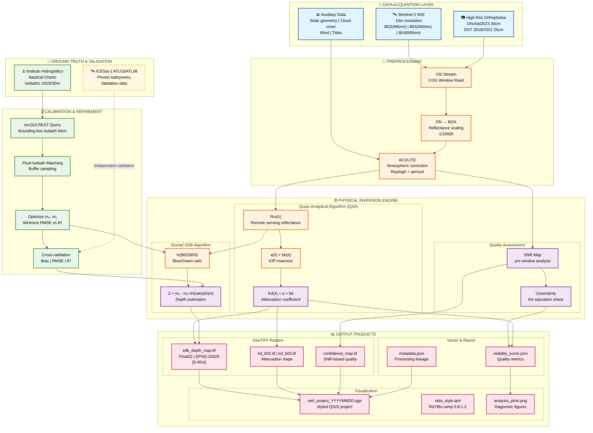

# Reef Imagery Pipeline

[](https://www.python.org/downloads/)
[](https://opensource.org/licenses/MIT)

Satellite imagery processing system for reef analysis and coastal bathymetry in the Algarve, Portugal. Combines Sentinel-2 data, high-resolution orthophotos (OrtoSat2023, DGT), and advanced physical-optical models for depth estimation and benthic visibility.

---

## 🏗️ System Architecture

```
reef_imagery_pipeline/
├── src/                    # Core package (physics + ML)
│   ├── reef_ml_predictor_acolite.py    # Main QAA + SDB model
│   ├── reef_ml_predictor.py            # STAC image ranking
│   ├── bathy_calibrator.py             # IH Isobath integration
│   ├── enhancer.py                     # Preprocessing + SNR
│   ├── utils.py                        # Raster I/O, Beer-Lambert
│   └── orchestrator_run.py             # Main orchestrator
│
├── scripts/                # Entry points and analysis
│   ├── reef_imagery_pipeline_v3.py     # Sentinel-2/DGT acquisition
│   ├── cdse_downloader_minimal.py      # CDSE download
│   ├── demo_bathy_live.py              # IH + SDB demo
│   ├── icesat2_algarve_bathy.py        # ICESat-2 validation
│   ├── sprint1_algarve_bathymetry.py   # Central Algarve bathymetry
│   ├── pedra_do_alto_best_images.py    # Automatic image selection
│   ├── save_refined_image*.py          # Temporal analyses
│   └── ...
│
├── tests/                  # Unit tests
├── archive/                # Legacy modules (v1, v2)
└── dashboard/              # Web visualization (Flask)
```

---

## 🔄 Data Pipeline



---

## 🚀 Quick Start

### 1. Installation

```bash
git clone https://github.com/3ruiruirui-sketch/reef-imagery-pipeline.git
cd reef-imagery-pipeline
pip install -r requirements_v3.txt
```

### 2. Basic Usage

#### Sentinel-2 + OrtoSat2023 Acquisition
```bash
python scripts/reef_imagery_pipeline_v3.py --step all \
    --lat 37.069071 --lon -8.210492 \
    --date 2024-10-15 \
    --output-dir reef_output_demo
```

#### Physical-Optical Processing (SDB + Kd)
```bash
python src/orchestrator_run.py --depth 16.0
```

#### IH Calibration Demo
```bash
python scripts/demo_bathy_live.py
```

---

## 📚 Core Modules

### `src/reef_ml_predictor_acolite.py`
Main physical inversion model based on:
- **QAA (Quasi-Analytical Algorithm)**: Kd inversion from Rrs
- **Stumpf SDB**: Bathymetry via B02/B03 log-ratio
- **IH Integration**: Calibration with official isobaths

**Key functions:**
- `run_predictor()` — Complete analysis pipeline
- `stumpf_sdb()` — Depth map generation
- `gordon_kd_inversion()` — Attenuation coefficient estimation
- `make_snr_map()` — Signal-to-noise ratio analysis

### `src/bathy_calibrator.py`
Integration with ArcGIS REST service from Instituto Hidrográfico:
- `fetch_isobaths_for_bbox()` — Query isobaths in area
- `calibrate_stumpf_from_isobaths()` — Derive m0/m1 coefficients
- `validate_sdb_vs_chart()` — Validate against IH data

### `src/enhancer.py`
Image preprocessing:
- `fetch_vsi_patch()` — Read via VSI (Virtual File System)
- NLM denoising + CLAHE
- SNR estimation

### `src/reef_ml_predictor.py` (Legacy)
Heuristic STAC image ranking based on:
- Cloud coverage
- Solar elevation
- Seasonal Kd490 coefficient

---

## 📊 Workflows

### Workflow 1: Complete Acquisition and Processing

```bash
# 1. Sentinel-2 acquisition
python scripts/reef_imagery_pipeline_v3.py \
    --step sentinel \
    --date 2024-09-30 \
    --output-dir reef_output_sep_2024

# 2. Physical processing
python -c "
from src.reef_ml_predictor_acolite import run_predictor
from src.utils import compute_metadata_stub

run_predictor(
    boa_b02_path='reef_output_sep_2024/S2_B02_20240930.tif',
    metadata=compute_metadata_stub('2024-09-30'),
    output_dir='reef_output_sep_2024/predictor',
    date='2024-09-30',
    b03_path='reef_output_sep_2024/S2_B03_20240930.tif',
    lat=37.069071, lon=-8.210492
)
"
```

### Workflow 2: Multi-Year Temporal Analysis

```bash
# Comparative analysis between 2022 and 2024
python scripts/save_refined_image_2022_09_26.py
python scripts/save_refined_image_2024_09_30.py

# Or use sprint1 for complete bathymetry
python scripts/sprint1_algarve_bathymetry.py
```

### Workflow 3: ICESat-2 Validation

```bash
# Search for ICESat-2 data in area
python scripts/icesat2_algarve_search.py

# Process and compare
python scripts/icesat2_algarve_bathy.py
```

---

## 📈 Expected Results

### Main Outputs

| File | Description | Format |
|------|-------------|--------|
| `S2_B02_YYYYMMDD.tif` | Sentinel-2 Blue band (10m) | GeoTIFF |
| `S2_B03_YYYYMMDD.tif` | Sentinel-2 Green band (10m) | GeoTIFF |
| `sdb_depth_map.tif` | SDB depth map | Float32 GeoTIFF |
| `kd_b02.tif` / `kd_b03.tif` | Diffuse attenuation coefficient | Float32 GeoTIFF |
| `confidence_map.tif` | Confidence map (SNR) | Float32 GeoTIFF |
| `visibility_score.json` | Benthic visibility metrics | JSON |
| `reef_project_YYYYMMDD.qgs` | Configured QGIS project | QGIS 3.x |

### Quality Metrics

| Metric | Expected Value | Description |
|--------|----------------|-------------|
| SDB resolution | 10m | Native Sentinel-2 |
| Maximum depth | ~30m | B02/B03 optical limit |
| RMSE vs IH | < 2m | After calibration |
| SNR threshold | > 3.0 | Acceptable quality |

---

## 🔬 Physical Methodology

### Stumpf SDB Model
```
Z = m0 - m1 * ln(B02/B03) / ln(n)
```
Where:
- `m0, m1`: calibrated coefficients (default: -16, 20)
- `n`: logarithmic scaling factor (default: 1000)
- `B02, B03`: BOA (Bottom-of-Atmosphere) reflectance

### QAA Inversion (Gordon et al.)
Kd estimation from surface reflectance:
```
Kd(λ) = a(λ) + bb(λ)
```
Where `a` is absorption and `bb` backscattering.

### IH Calibration
Adjustment of `m0, m1` via official isobath ground-truth (10m, 20m, 30m).

---

## 🛠️ Development

### Run Tests
```bash
python tests/test_bathy_calibrator.py
python tests/test_fft_cleanliness.py
python tests/test_stac.py
```

### Import Structure
```python
# From src/ (core package)
from src.reef_ml_predictor_acolite import run_predictor, stumpf_sdb
from src.bathy_calibrator import calibrate_stumpf_from_isobaths
from src.enhancer import fetch_vsi_patch
from src.utils import read_band, write_band

# From scripts/ (do not import between scripts)
# Run directly: python scripts/xxx.py
```

---

## 📖 Historical Documentation

- `README_v2.md` — Version 2 documentation (legacy, in `archive/`)
- `README_v3.md` — v3 downloader docs (now in `scripts/`)
- `SENTINEL_ANALYSIS_SUMMARY.md` — Detailed spectral analysis

---

## 🤝 Contributing

See `CONTRIBUTING.md` for development guidelines.

---

## 📄 License

MIT License — see LICENSE file for details.

---

## 🙋 Support

For questions or issues, open a GitHub ticket or contact the author via email.

---

**Last updated:** May 2026  
**Current version:** v3.1 (restructured)
