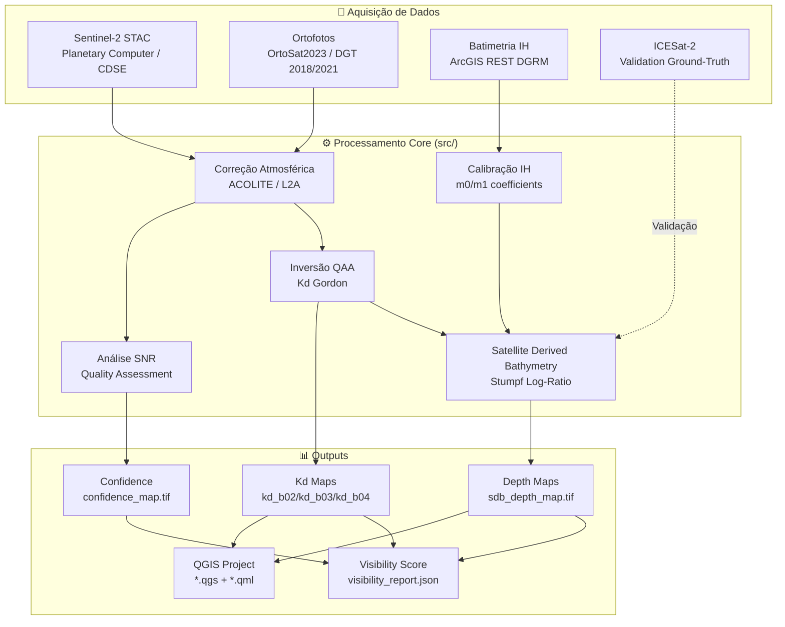

# Reef Imagery Pipeline

[](https://www.python.org/downloads/)
[](https://opensource.org/licenses/MIT)

Sistema de processamento de imagens de satélite para análise de recifes e batimetria costeira no Algarve, Portugal. Combina dados Sentinel-2, ortofotos de alta resolução (OrtoSat2023, DGT), e modelos físico-ópticos avançados para estimativa de profundidade e visibilidade bentónica.

---

## 🏗️ Arquitetura do Sistema

```
reef_imagery_pipeline/
├── src/                    # Core package (física + ML)
│   ├── reef_ml_predictor_acolite.py    # Modelo principal QAA + SDB
│   ├── reef_ml_predictor.py            # Ranking de imagens STAC
│   ├── bathy_calibrator.py             # Integração IH Isobathas
│   ├── enhancer.py                     # Preprocessamento + SNR
│   ├── utils.py                        # I/O raster, Beer-Lambert
│   └── orchestrator_run.py             # Orquestrador principal
│
├── scripts/                # Entry points e análises
│   ├── reef_imagery_pipeline_v3.py     # Aquisição Sentinel-2/DGT
│   ├── cdse_downloader_minimal.py      # Download CDSE
│   ├── demo_bathy_live.py              # Demo IH + SDB
│   ├── icesat2_algarve_bathy.py        # Validação ICESat-2
│   ├── sprint1_algarve_bathymetry.py   # Batimetria Algarve Central
│   ├── pedra_do_alto_best_images.py    # Seleção automática de imagens
│   ├── save_refined_image*.py          # Análises temporais
│   └── ...
│
├── tests/                  # Testes unitários
├── archive/                # Módulos obsoletos (v1, v2)
└── dashboard/              # Visualização web (Flask)
```

---

## 🔄 Pipeline de Dados



---

## 🚀 Quick Start

### 1. Instalação

```bash
git clone https://github.com/3ruiruirui-sketch/reef-imagery-pipeline.git
cd reef-imagery-pipeline
pip install -r requirements_v3.txt
```

### 2. Uso Básico

#### Aquisição Sentinel-2 + OrtoSat2023
```bash
python scripts/reef_imagery_pipeline_v3.py --step all \
    --lat 37.069071 --lon -8.210492 \
    --date 2024-10-15 \
    --output-dir reef_output_demo
```

#### Processamento Físico-Óptico (SDB + Kd)
```bash
python src/orchestrator_run.py --depth 16.0
```

#### Demo com Calibração IH
```bash
python scripts/demo_bathy_live.py
```

---

## 📚 Módulos Core

### `src/reef_ml_predictor_acolite.py`
Modelo principal de inversão física baseado em:
- **QAA (Quasi-Analytical Algorithm)**: Inversão de Kd a partir de Rrs
- **Stumpf SDB**: Bathymetria por log-ratio B02/B03
- **Integração IH**: Calibração com isobathas oficiais

**Funções principais:**
- `run_predictor()` — Pipeline completo de análise
- `stumpf_sdb()` — Geração de mapa de profundidade
- `gordon_kd_inversion()` — Estimativa de coeficiente de atenuação
- `make_snr_map()` — Análise de relação sinal-ruído

### `src/bathy_calibrator.py`
Integração com serviço ArcGIS REST do Instituto Hidrográfico:
- `fetch_isobaths_for_bbox()` — Query de isobathas na área
- `calibrate_stumpf_from_isobaths()` — Derivação de coeficientes m0/m1
- `validate_sdb_vs_chart()` — Validação contra dados IH

### `src/enhancer.py`
Preprocessamento de imagens:
- `fetch_vsi_patch()` — Leitura via VSI (Virtual File System)
- Denoising NLM + CLAHE
- SNR estimation

### `src/reef_ml_predictor.py` (Legacy)
Ranking heurístico de imagens STAC baseado em:
- Cobertura de nuvens
- Elevação solar
- Coeficiente Kd490 sazonal

---

## 📊 Workflows

### Workflow 1: Aquisição e Processamento Completo

```bash
# 1. Aquisição Sentinel-2
python scripts/reef_imagery_pipeline_v3.py \
    --step sentinel \
    --date 2024-09-30 \
    --output-dir reef_output_sep_2024

# 2. Processamento físico
python -c "
from src.reef_ml_predictor_acolite import run_predictor
from src.utils import compute_metadata_stub

run_predictor(
    boa_b02_path='reef_output_sep_2024/S2_B02_20240930.tif',
    metadata=compute_metadata_stub('2024-09-30'),
    output_dir='reef_output_sep_2024/predictor',
    date='2024-09-30',
    b03_path='reef_output_sep_2024/S2_B03_20240930.tif',
    lat=37.069071, lon=-8.210492
)
"
```

### Workflow 2: Análise Temporal Multi-Ano

```bash
# Análise comparativa entre 2022 e 2024
python scripts/save_refined_image_2022_09_26.py
python scripts/save_refined_image_2024_09_30.py

# Ou usar sprint1 para batimetria completa
python scripts/sprint1_algarve_bathymetry.py
```

### Workflow 3: Validação com ICESat-2

```bash
# Procurar dados ICESat-2 na área
python scripts/icesat2_algarve_search.py

# Processar e comparar
python scripts/icesat2_algarve_bathy.py
```

---

## 📈 Resultados Esperados

### Saídas Principais

| Ficheiro | Descrição | Formato |
|----------|-----------|---------|
| `S2_B02_YYYYMMDD.tif` | Banda azul Sentinel-2 (10m) | GeoTIFF |
| `S2_B03_YYYYMMDD.tif` | Banda verde Sentinel-2 (10m) | GeoTIFF |
| `sdb_depth_map.tif` | Mapa de profundidade SDB | Float32 GeoTIFF |
| `kd_b02.tif` / `kd_b03.tif` | Coeficiente de atenuação difusa | Float32 GeoTIFF |
| `confidence_map.tif` | Mapa de confiança (SNR) | Float32 GeoTIFF |
| `visibility_score.json` | Métricas de visibilidade bentónica | JSON |
| `reef_project_YYYYMMDD.qgs` | Projeto QGIS configurado | QGIS 3.x |

### Métricas de Qualidade

| Métrica | Valor Esperado | Descrição |
|---------|----------------|-----------|
| Resolução SDB | 10m | Sentinel-2 nativo |
| Profundidade máxima | ~30m | Limite óptico B02/B03 |
| RMSE vs IH | < 2m | Após calibração |
| SNR threshold | > 3.0 | Qualidade aceitável |

---

## 🔬 Metodologia Física

### Modelo Stumpf SDB
```
Z = m0 - m1 * ln(B02/B03) / ln(n)
```
Onde:
- `m0, m1`: coeficientes calibrados (default: -16, 20)
- `n`: fator de escala logarítmica (default: 1000)
- `B02, B03`: reflectância BOA (Bottom-of-Atmosphere)

### Inversão QAA (Gordon et al.)
Estimativa de Kd a partir de reflectância de superfície:
```
Kd(λ) = a(λ) + bb(λ)
```
Onde `a` é absorção e `bb` backscattering.

### Calibração IH
Ajuste de `m0, m1` via ground-truth de isobathas oficiais (10m, 20m, 30m).

---

## 🛠️ Desenvolvimento

### Executar Testes
```bash
python tests/test_bathy_calibrator.py
python tests/test_fft_cleanliness.py
python tests/test_stac.py
```

### Estrutura de Imports
```python
# De src/ (core package)
from src.reef_ml_predictor_acolite import run_predictor, stumpf_sdb
from src.bathy_calibrator import calibrate_stumpf_from_isobaths
from src.enhancer import fetch_vsi_patch
from src.utils import read_band, write_band

# De scripts/ (não importar entre scripts)
# Executar diretamente: python scripts/xxx.py
```

---

## 📖 Documentação Histórica

- `README_v2.md` — Documentação da versão 2 (obsoleta, em `archive/`)
- `README_v3.md` — Documentação do downloader v3 (agora em `scripts/`)
- `SENTINEL_ANALYSIS_SUMMARY.md` — Análise espectral detalhada

---

## 🤝 Contribuição

Veja `CONTRIBUTING.md` para guidelines de desenvolvimento.

---

## 📄 Licença

MIT License — ver ficheiro LICENSE para detalhes.

---

## 🙋 Suporte

Para questões ou issues, abrir ticket no GitHub ou contactar via email do autor.

---

**Última atualização:** Maio 2026  
**Versão atual:** v3.1 (estrutura reestruturada)
