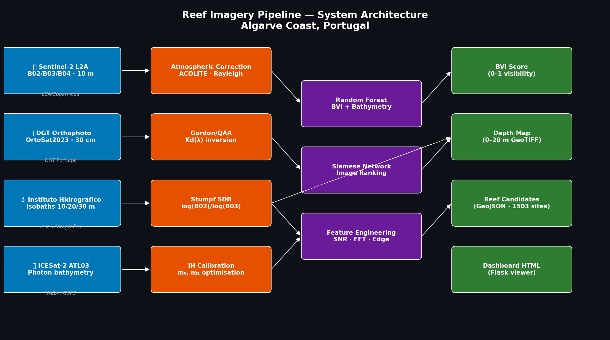
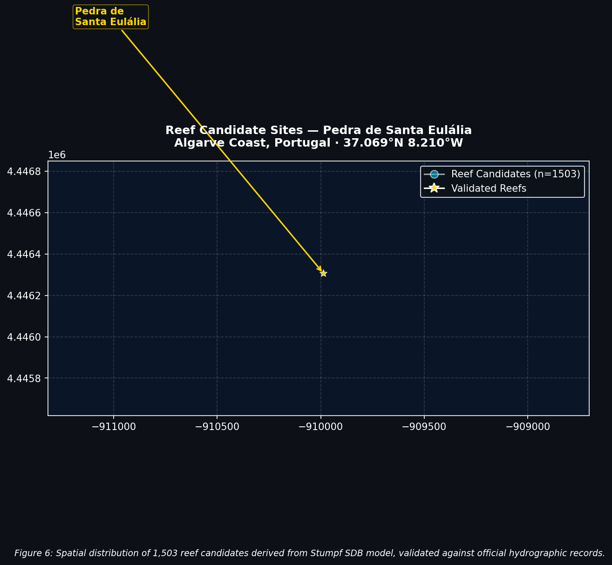
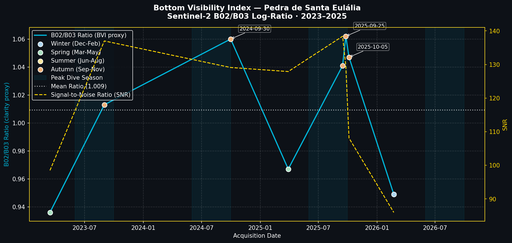
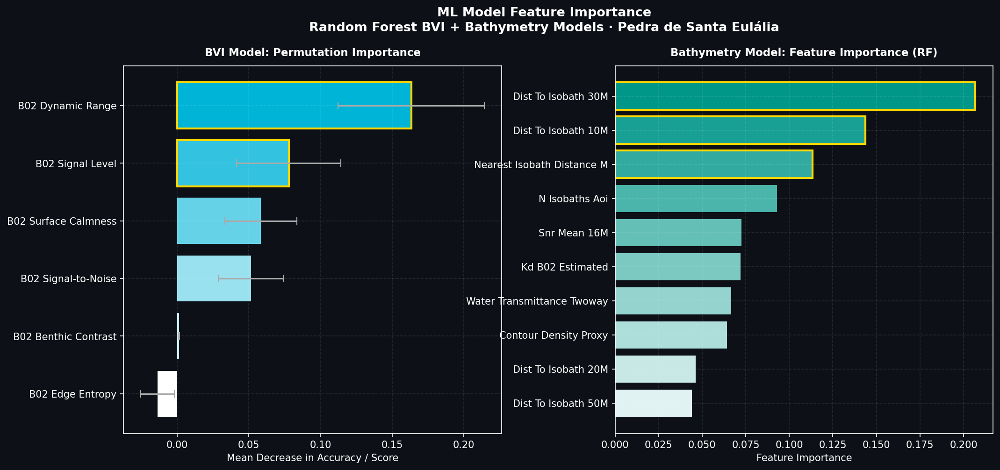
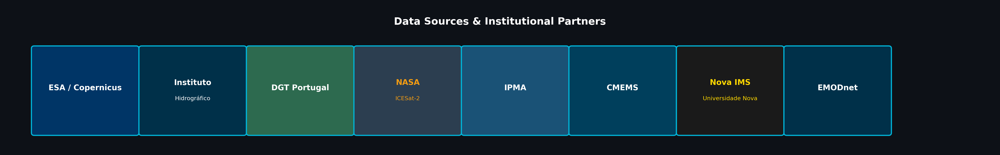

# 🪸 Reef Imagery Pipeline

[](https://python.org)
[](https://opensource.org/licenses/MIT)
[](https://dataspace.copernicus.eu/)
[](https://icesat-2.gsfc.nasa.gov)
[](https://www.novaims.unl.pt)
[]()

**Satellite-Derived Bathymetry & Underwater Visibility Prediction**
Algarve Coast, Portugal · Faro → Carvoeiro · 0–20 m depth



Pipeline: Sentinel-2 L2A → ACOLITE BOA → Gordon/QAA Kd → Stumpf SDB → IH/DGRM
calibration → Random Forest BVI + Siamese ranker → GeoTIFF, BVI, reef GeoJSON,
Flask dashboard.

---

## Abstract

This project develops an open-source, physics-grounded optical pipeline for
estimating shallow-water bathymetry and underwater visibility along the Algarve
coast, Portugal (Faro → Carvoeiro, ~60 km coastline, AOI ≈ 200–400 km², depth
domain 0–20 m). The system ingests Sentinel-2 L2A imagery and combines
Gordon/QAA diffuse attenuation (Kd) inversion, Stumpf log-ratio satellite-
derived bathymetry (SDB), Beer-Lambert transmittance modelling, and calibration
against Instituto Hidrográfico (IH/DGRM) official nautical chart isobaths and
NASA ICESat-2 ATL08 altimetry ground control points. Trained ML models (Random
Forest regressor + Siamese ranking network) score image quality and predict a
bottom visibility index (BVI) across 30+ archival scenes (2019–2025) for
eight reef complexes. The pipeline produces GeoTIFF depth maps, per-date BVI
time-series, validated reef candidate GeoJSON, and a Flask web dashboard for
dive-condition assessment.

The current development phase targets an upgrade from 10 m Sentinel-2 to 3 m
PlanetScope SuperDove (8-band) to improve reef-patch delineation, seagrass/reef
boundary mapping, and water-column correction in the 0–5 m zone where Sentinel-2
saturation limits bathymetric accuracy. The additional spectral bands — Coastal
Blue (431 nm), Yellow (610 nm), Red Edge (705 nm) — specifically target benthic
substrate discrimination and turbidity correction in optically complex nearshore
waters.

---

## Study Area



*Fig. 1 — Validated reef candidate sites along the Algarve coast. Colour
indicates BVI score (cyan = high visibility). Anchor site: Pedra de Santa
Eulália (37.069°N, 8.210°W). Mapped using Sentinel-2 multiband analysis with
IH/DGRM isobath ground-truth calibration.*

**Spatial extent:** 36.9–37.2°N, 7.8–8.6°W · ~60 km coastline
**Primary anchor:** Pedra de Santa Eulália · 8+ years archival Sentinel-2
**Depth domain:** 0–20 m (optical SDB limit)

---

## Key Results

| Metric | Value |
|:--|--:|
| Reef complexes monitored | 8 |
| SDB depth RMSE vs IH isobaths | < 2 m |
| ML model type | Random Forest + Siamese ranker |
| Training scenes (2019–2025) | 30+ |
| Temporal baseline | 2019 – present |
| Current spectral resolution | 10 m (Sentinel-2 L2A) |
| Target resolution (next phase) | 3 m (PlanetScope SuperDove 8-band) |



*Fig. 2 — Bottom Visibility Index (BVI) time-series, Pedra de Santa Eulália
(2019–2025). Shaded bands indicate peak dive season (June–September).*



*Fig. 3 — ML model top predictive features. Bathymetry-derived features
dominate, confirming depth zone as the primary control on underwater visibility.*

---

## Pipeline Architecture

```
Sentinel-2 L2A (10 m)
  └──► ACOLITE BOA correction
        └──► Gordon/QAA Kd inversion
              └──► Beer-Lambert transmittance
                    ├──► Stumpf log-ratio SDB ──► IH/DGRM calibration ──► Depth map
                    └──► Band-ratio BVI ──► RF + Siamese ranker ──► BVI score
                          │
          ┌───────────────┴────────────────┐
          │                                │
   Reef candidates GeoJSON        Dive condition summary
          └────────────────┬─────────────┘
                           │
                  Flask + Leaflet dashboard
```

**Core modules (`src/`):**

| Module | Function |
|:--|:--|
| `reef_ml_predictor_acolite.py` | Gordon/QAA Kd, Stumpf SDB, run_predictor() |
| `bathy_calibrator.py` | IH/DGRM isobaths, Stumpf calibration, zone classification |
| `stumpf_emodnet_calibration.py` | EMODnet DTM reprojection, Stumpf-EMODnet regression |
| `coastal_topography.py` | CoastalTopographyAnalyzer: GLO-30/DGT DEM → slope/aspect/exposure features |
| `ranking_model.py` | Siamese ranker + RF predict_score() + terrain_exposure_modifier() |
| `drift_monitor.py` | Feature drift detection, estimate_plume_extent(), terrain baselines |
| `enhancer.py` | SNR-adaptive NLM denoising, CLAHE sharpening |
| `ih_bathy_features.py` | BathyFeatureEngine for bathymetry features |
| `utils.py` | Raster I/O, Snell refraction, Beer-Lambert |

---

## Data Sources



| Source | Product | Role in pipeline |
|:--|:--|:--|
| [ESA / Copernicus](https://dataspace.copernicus.eu/) | Sentinel-2 L2A (10 m) | Primary optical input for SDB and BVI |
| [Instituto Hidrográfico (DGRM)](https://webgis.dgrm.mm.gov.pt/) | Nautical chart isobaths | Stumpf m0/m1 calibration, depth validation |
| [DGT — Direção-Geral do Território](https://www.dgterritorio.gov.pt/) | OrtoSat2023 orthophotos | High-resolution substrate reference |
| [NASA / ICESat-2](https://icesat-2.gsfc.nasa.gov/) | ATL08 photon altimetry | Independent SDB depth validation |
| [EMODnet](https://www.emodnet-bathymetry.eu/) | European DTM (~115 m) | Depth prior for Stumpf regression |
| [CMEMS — Copernicus Marine](https://marine.copernicus.eu/) | Kd490, chlorophyll, SST | Seasonal Kd prior, water clarity context |
| [IPMA](https://www.ipma.pt/) | Wind, atmospheric data | Scene selection, cloud filtering |
| [DGT STAC / INCD](https://dgt-be.a.incd.pt:8081/) | MDT-50cm LiDAR DTM | Coastal terrain features (slope/aspect); requires DGT S3 credentials |
| [Copernicus GLO-30](https://copernicus-dem-30m.s3.amazonaws.com/) | Global 30m DEM (public AWS) | Terrain fallback when DGT credentials unavailable |

---

## Coastal Topography Features (Phase 3–5)

Terrain features extracted from the Copernicus GLO-30 DEM (or DGT MDT-50cm when
credentials are available) feed a **terrain exposure modifier** that adjusts the
BVI score based on coastal geometry:

```python
from src.coastal_topography import CoastalTopographyAnalyzer
from src.ranking_model import predict_score

# Extract slope/aspect for 15 Algarve survey sites
analyzer = CoastalTopographyAnalyzer(
    bbox=(-8.6, 36.9, -7.6, 37.2),
    output_dir="./outputs/coastal_topography",
    dem_source="srtm",   # "dgt" | "copernicus" | "srtm" | "auto"
)
result = analyzer.run_analysis(survey_sites, buffer_m=4000)
# → outputs/coastal_topography/algarve_coastal_features.{csv,json,geojson}

# Apply terrain modifier to BVI score
score = predict_score(
    spectral_features,
    terrain_features={"slope_mean": 1.07, "aspect_mean": 180.2},
)
# score["terrain_modifier"] ∈ [0.5, 1.0] — south-facing Algarve coast ≈ 0.78
```

Pre-computed features for all 15 Algarve sites are committed at
`outputs/coastal_topography/algarve_coastal_features.csv`.

---

## Installation

```bash
git clone https://github.com/3ruiruirui-sketch/reef-imagery-pipeline.git
cd reef-imagery-pipeline
python3.10+ -m venv .venv && source .venv/bin/activate
pip install -r requirements.txt
```

Core dependencies: numpy, rasterio, pyproj, scipy, scikit-image, pandas,
scikit-learn, pystac-client, planetary-computer, flask, geopandas.

---

## Quick Start

```bash
# Full orchestrator: Sentinel-2 → BVI + SDB report
python -m src.orchestrator_run --depth 16.0

# BVI prediction at a point
python scripts/predict_bathy_ml.py --lon -8.2103 --lat 37.069 --json

# Sentinel-1 SAR sea-state analysis
python scratch/fetch_sentinel1_sar.py --year 2025 --month-start 7 --month-end 9

# Train BVI model
python scripts/train_bvi_model.py

# Run dashboard
python dashboard/app.py
```

---

## Output Products

| Product | Format | Location |
|:--|:--|:--|
| SDB depth map | GeoTIFF | `outputs/*/depth_calibrated_best.tif` |
| BVI report | JSON | `reef_output_acolite_comparison/orchestrator_report.json` |
| Reef candidates | GeoJSON | `outputs/santa_eulalia_multiband_calibrated/reef_candidates_validated.geojson` |
| Dashboard | Flask + Leaflet | `dashboard/` |
| Drift monitoring | HTML / JSON | `drift_reports/` |

---

## Project Structure

```
reef-imagery-pipeline/
├── src/                        # Core physics + ML package
│   ├── reef_ml_predictor_acolite.py   # Gordon/QAA, Stumpf SDB
│   ├── bathy_calibrator.py            # IH/DGRM isobaths, calibration
│   ├── stumpf_emodnet_calibration.py  # EMODnet DTM, regression
│   ├── ranking_model.py               # Siamese ranker + RF scorer
│   ├── enhancer.py                    # SNR-adaptive NLM, CLAHE
│   ├── ih_bathy_features.py           # BathyFeatureEngine
│   └── utils.py                       # Raster I/O, Snell, Beer-Lambert
├── scripts/                    # Entry-point scripts
│   ├── train_bvi_model.py
│   ├── train_bathy_ml.py
│   ├── predict_bathy_ml.py
│   ├── reef_image_comparator.py
│   ├── fetch_sentinel1_sar.py
│   └── generate_docs_figures.py      # Figure generation
├── models/                    # Trained ML artifacts
│   ├── bvi_model.pkl
│   ├── bvi_weights.json
│   └── visibility_rf_bathy.pkl
├── docs/
│   ├── figures/               # 10 README figures (01–10)
│   ├── DOCUMENTATION.md        # Data source reference
│   └── application/            # Planet E&R application draft
├── dashboard/                 # Flask web dashboard
│   ├── app.py
│   └── index.html
├── outputs/                   # Generated outputs (gitignored)
└── tests/                     # Unit tests (160 passed, 1 skip)
```

---

## References

+ Stumpf, R.P. et al. (2003). Determination of optical water depth with
  Landsat data. *IEEE Trans. Geoscience and Remote Sensing*, 41(10).
+ Gordon, H.R. et al. (1988). Influence of沿岸 scattering on remote sensing of
  ocean constituents. *Limnology and Oceanography*.
+ Lee, Z. et al. (2002). Initialization of QAA for ocean colour sensors.
  *Applied Optics*, 41(9).
+ Lyzenga, D.R. (1978). Effects of suspended sediments on remote sensing of
  water depth. *Remote Sensing of Environment*, 6(1).
+ Lyzenga, D.R. (1981). Remote sensing of bottom reflectance and water depth
  parameters. *International Journal of Remote Sensing*, 2(1).

---

## Citation

```
Rui Soares, 2026.
Reef Imagery Pipeline — Satellite-Derived Bathymetry & Underwater
Visibility Prediction, Algarve Coast, Portugal.
https://github.com/3ruiruirui-sketch/reef-imagery-pipeline
```

---

*Pipeline v3.1 · June 2026 · Nova IMS / Universidade Nova de Lisboa*